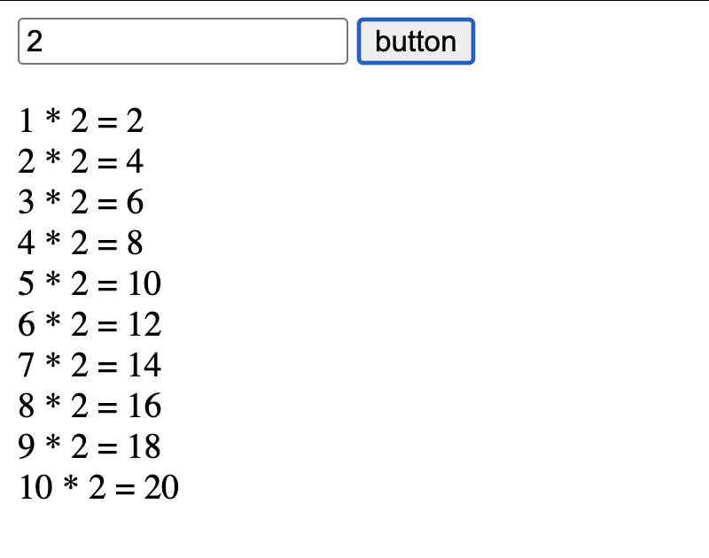

## Assignments JS: Build a Multiplication Table with Conditionals

Create a webpage that generates a multiplication table based on user input. The user will input a number, and the table will be generated using a for loop. If the result of any cell is even, it will be highlighted with a different background color.

For Html part, create a form with:
- A text input field where the user can enter a number.
- A button to trigger the multiplication table generation.
- Use pre-defined p elements to display the results.

For JavaScript part:
- 	Create a function generateTable() that runs when the button is clicked.
-	Use a for loop to calculate and display the results inside the existing p elements.
-	Use an if-else statement to check if the result is even or odd and adjust the text (or style) accordingly.

<strong>Reference</strong><br>
You can use textContent to change the text inside an HTML element. For example:
```
const element = document.getElementById('row1');
element.textContent = 'Hello World!';
```

This will find the element with the ID row1 and change its text to "Hello World!".

Also to get input value you can use:
```
const value = document.getElementById('number').value;
```
This will get the value entered by the user into the input field with the ID number.

Checking if a number is even: You can use the modulo operator % to check if a number is even:
```
if (number % 2 === 0) {
  // This number is even }
```




